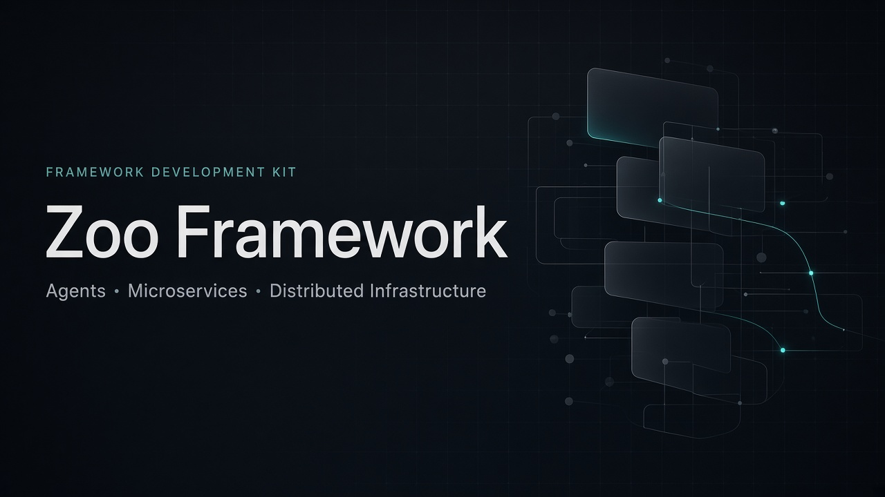

# Zoo FDK
Orchestration & Development of Compound AI Systems, Microservices, Agents, & Distributed Infrastructure Provisionment, Configuration & Operation -- Framework.

windows server i'll wait for them to be easier to work with (windows _server_, not the workstations.) 

vagrant (box registries no longer maintained after december 31st 2026)
docker/podman
kubernetes (container orchestration, tbe.)
terraform (infrastructure provision)
ansible (remote machine configuration)
helm (k8s pkg manager)

# ZFDK Development
The high level semantics and low-level primitive abstractions change a lot in this version of the repository, state.